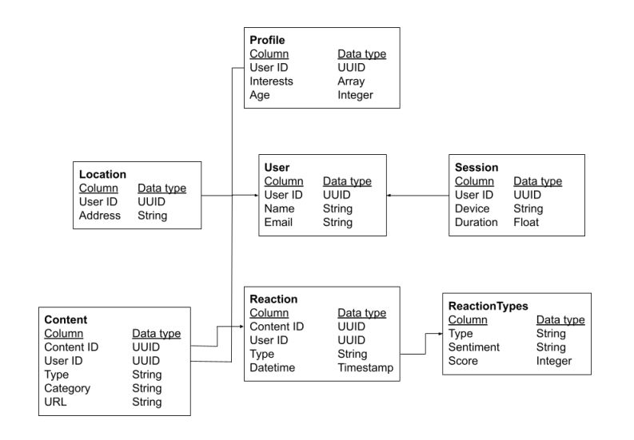

# Accenture-Data-Analytics-and-Visualization-Virtual-Internship
Virtual Internship at Accenture

# Given Dataset
Three dataset is provided.
- [Content](Content.csv)
- [Reactions](Reactions.csv)
- [ReactionTypes](ReactionTypes.csv)

# Problem Statement
Analyse content categories showing the top 5 categories with the largest popularity

# Data Cleaning
### Clean the data by:
- Removing rows that have values which are missing.
- Changing the data type of some values within a column.
- Think about how each column might be relevant to the business question. If a column is not useful, it may not be worth including it.
- Removing columns which are not relevant to this task.

# Final Dataset
### Create a final dataset after merging of 3
[Cleaned Dataset](Cleaned_Dataset.xlsx)

# Data Modeling

# Data Analysis
Perform data analysis on the cleaned dataset.

# Data Visualization and Storytelling
### Visualize Data by making:
- Pie Chart
- Bar chart
### Make the Powerpoint presentation
[PowerPoint Presentation](PowerPoint presentation.pptx)

# Certificate
[Certificate](Accenture_complrtion_certificate.pdf)
